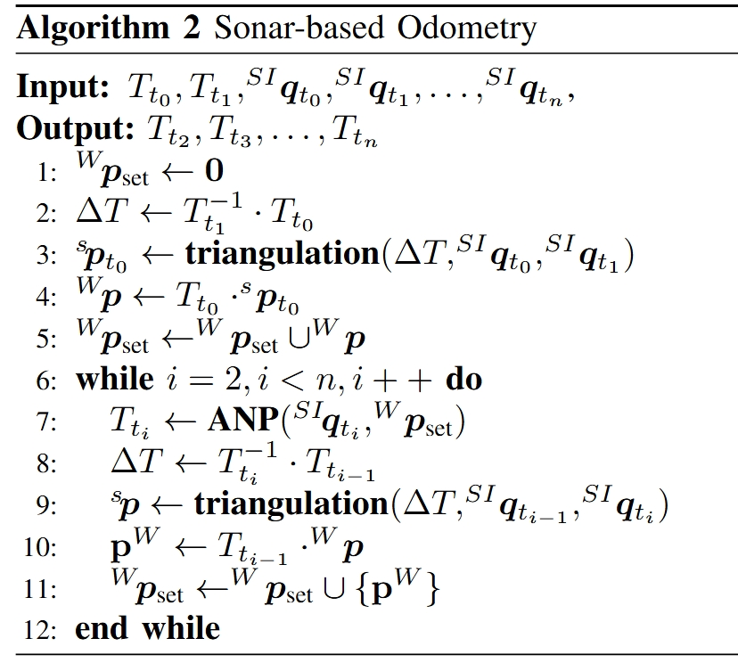

# Odometry

# Overview

This code is for Section V.*B. Sonar-Based Odometry with Unknown 3D Points*. The algorithm is as following.



# Quick Setup

Clone the repository into your catkin workspace's src folder and build the package:

```jsx
cd ~/catkin_ws/src
git clone https://github.com/LIAS-CUHKSZ/BESTAnP.git
cd ~/catkin_ws
catkin build
```

# How to run

### Dataset

Detailed information for simulated dataset is in `yaml/sim_env.yaml`:

```yaml
points_parameters: # where you can set the range and number of 3D feature points
  xmin: -10
  xmax: 10
  ymin: -10
  ymax: 10
  zmin: -2
  zmax: 2
  pts_num: 5000

sonar_attribute: # sonar parameters 
  fov_horizontal: 60 # horizontal aperture  -30 degree ~ 30 degree
  fov_vertical: 20 # vertical aperture -10 degree ~ 10 degree
  range_max: 6 # detection range
```

We provide 3 trajectory. You can find the recorded data under `data/` with **sonar_data.csv,** where we provide robot poses T_t and sonar data SI_q_t. We set noise added to  T_t and SI_q_t in `yaml/odom.yaml` .

### Run Single Experiment

To run the odometry, if you want to visualize the odomery result, please set parameter **RECORD as True** in `yaml/odom.yaml`  and run:

```jsx
rosrun BESTAnP main.py
or 
cd scripts && python3 main.py
```

Then you can find the recorded data under `record/` folder and compare the performance by running `record/analysis_trajecotry.py`

### Large-scale Experiments

During the experiment, we do large-scale experiment by varing random seed to see the odometry  performance under different ANP algorithm statistically.

You can run:

```jsx
rosrun BESTAnP main_batches.py
or 
cd scripts && python3 main_batches.py
```

The experimental results are stored in results/results.npy. To analyze the statistical findings, please run `results/analysis_statistically.py`