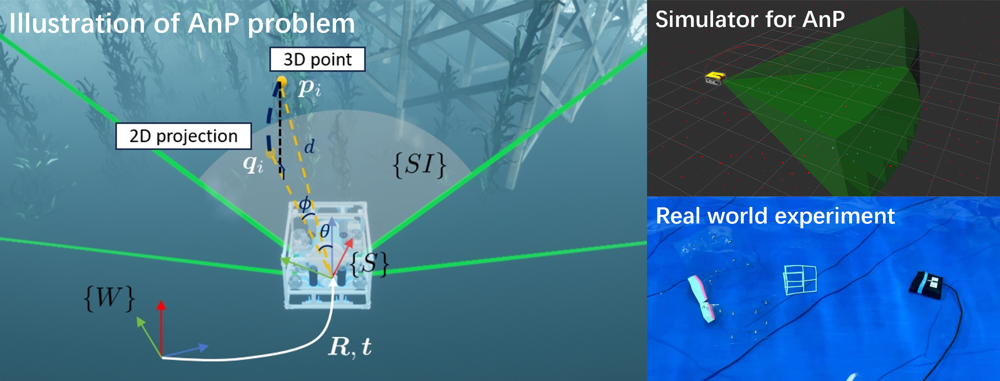

# BESTAnP

**[Submitted to IEEE RA-L]** This repository is the official code for [BESTAnP: Bi-Step Efficient and Statistically Optimal Estimator for Acoustic-n-Point Problem](https://arxiv.org/abs/2411.17521)

Wenliang Sheng*, Hongxu Zhao*, [Lingpeng Chen](https://scholar.google.com/citations?user=8jlmwvoAAAAJ&hl=en)*, [Guangyang Zeng](https://guangyangzeng.github.io/)†, Yunling Shao, Yuze Hong, [Chao Yang](https://chaoyang2013.github.io/)†, [Ziyang Hong](https://scholar.google.com/citations?user=IUi8EjkAAAAJ&hl=en), and [Junfeng Wu](https://lias-cuhksz.github.io/group/junfeng-wu)

(* represents equal contribution.)

[**The Laboratory for Intelligent Autonomous Systems (LIAS)**](https://lias-cuhksz.github.io/)

# **News**

- [November, 2024] ReFeree is submitted to RA-L and paper is available on arxiv
- [November, 2024] Algorithm and simulation code is released

# **What is the BESTAnP?**

- A bi-step algorithm that solves the acoustic-n-point pose estimation problem (estimating sonar sensor's position and orientation using n matching pairs between 3D points in world frame and their 2D projections in sonar image) for 2D forward-looking sonar
- Decouples pose estimation into two steps: translation estimation via range-based localization, followed by rotation estimation

# What this repo provide and how to use

## Algorithm in matlab

If you only want the source code for BESTAnP and baseline algorithms, you can go to folder [MatlabCode](https://github.com/LIAS-CUHKSZ/BESTAnP/blob/main/MatabCode/README.md).

## Sonar-only odometry

In this work, we integrate our BESTAnP algorithm with feature point triangulation to develop a pure sonarbased odometry system. To the best of our knowledge, no study has put forward an odometry from
sonar-only measurements.

## AnP simulator

Anp simulator is a ROS package developed under ros-noetic with which you can test your own algorithm. If you want to generate data set by our own, you can use our package.

# **Contact**

- Lingpeng Chen (lingpengchen@link.cuhk.edu.cn)
- Wenliang Sheng (y30210936@mail.ecust.edu.cn)
- Guangyang Zeng (zengguangyang@cuhk.edu.cn)
